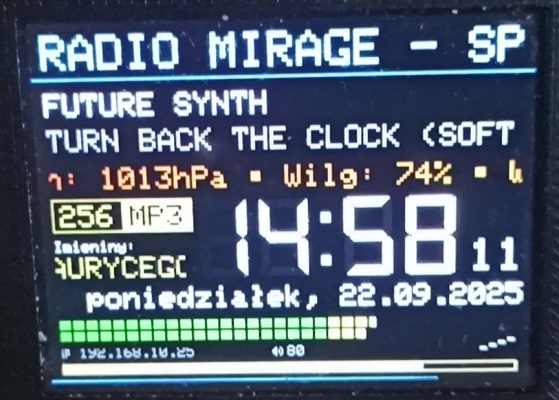
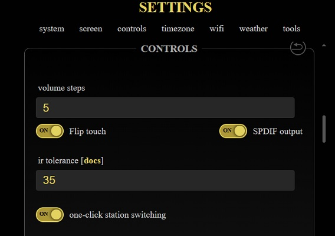

Zmodyfikowana wersja projektu yoRadio (eRadio) z: https://github.com/e2002/yoradio  
English version of Readme bellow.

  

https://www.youtube.com/watch?v=0B93uhm7WAI https://www.youtube.com/watch?v=uwM8PoyT15s

Nowa wersja oparta na pliku yoRadio_ESP32-S3_N16R8_ILI9488_v0.9.720_V-Tom_v04.2.zip. 
Działa z wyświetlaczem ST7789 320x240, ILI9341** 320x240, oraz 480x320 ILI9488**, ST7796** i AXS15231B (Guition) oraz oled SSD1306/SH1106.
Obsługiwany jest standardowy układ ESP32 WROVER (lub WROOM + zewnętrzna pamięć PSRAM) lub ESP32-S3. PSRAM wymagany. 
** nie testowałem tych modeli TFT ale powinny działać.

Co nowego lub się zmieniło:
- Funkcja przewijania utworu odtwarzanego z karty SD przy pomocy enkodera 1. Wciśnij enkoder i obróć wciśnięty. Można puścić przycisk, i teraz obracając enkoder przewijamy utwór w przód/tył. Po 2 sekundach bezruchu enkoder wraca do standardowego trybu.
- Przetestowane na oledach SSD1306/SH1106 128x64. Poprawione ekrany na tych oledach, wyświetlany jest widżet bitrate + parę innych poprawek.
- Dodane dwa przyciski na pilocie IR. Dedykowany włącz/wyłącz, oraz przycisk MUTE. Należy wgrać ponownie do esp zawartość folderu "data/www" po czym odświerzyć cache przeglądarki. W IR Record powinny być widoczne dodatkowe przyciski. Następnie na nowo trzeba ustawić kody przycisków pilota.
- Radykalnie poprawiona dokładność zegarka
- Dodano obsługę wyświetlaczy AXS15231B z pojemnościowym zintegrowanym touchscteenem (moduł GUITION JC3248W535)
- Lewo/Prawo na touchscreenie podczas odtwarzania z karty SD działa jako przewijanie utworu.
- Odczyt ID3 tagów (również v1) z plików MP3 na karcie SD
- W trybie odtwarzania z SD pasek głośności zmienia kolor i staje się w paskiem postępu ostwarzania utworu. Pokazywany jest też czas do końca utworu.
- Dodano opcje TS_MIRROR_X i TS_MIRROR_Y dla ustalenia prawidłowej orientacji touchscreena.
- Więcej kontroli przez touchscreen. Klik u góry po lewej lub prawej - poprzednia/nastepna stacja, góra-środek - przełączanie WEB/SD, klik na dole po lewej/prawej - regulacja głośności z repetycją. W trybie playlisty klik prawo-góra daje -1/-10 na liście (-10 po przytrzymaniu), prawo-dół daje +1/+10 na liście (+10 po przytrzymaniu), a klik na lewej połowie ekranu zatwierdza wybór.
- Dodano możliwość zmiany jasności wyświetlacza z pilota IR i touchscreena. Jak odtwarzanie jest zatrzymane to jasność regulują przyciski głoścości / lewo-prawo na touchscreenie.
- Zainstalowana wyszukiwarka stacji radiowych - lupka w interfejscie www.
- Jednoczesne działanie wielu scroll'i na ekranie.
- Brak strony z ustawieniami głośności. Zmiana głośności jest sygnalizowana tylko za pomocą paska głośności i wartości na głównym ekranie odtwarzacza.
- Tylko przycisk „Play” na pilocie może wybudzić odtwarzacz z trybu uśpienia/wygaszacza ekranu.
- Dodano przewijanie dla wyświetlania imienin (PL, NL, HU)
- Zmieniono układ wyświetlacza. Dla wyświetlaczy o rozdzielczości 320x240 i 480x320
- Dodano obsługę wielu języków: EN, RU, PL, HU, NL, EL.
- Dodano obsługę wyjścia SPDIF. Może to być wyjście koncentryczne (COAX) lub optyczne (OPTICAL).

Wyjście SPDIF może działać zamiennie ze zwykłym przetwornikiem cyfrowo-analogowym I2S lub wewnętrznym przetwornikiem cyfrowo-analogowym. Nie można używać SPDIF wraz z VS1053. 
Jedynym sposobem w tej sytuacji jest całkowite wyłączenie VS1053. 
Aktualny typ wyjścia można przełączać („w locie”) za pomocą „Ustawień” w interfejsie WWW. 
W tym celu używam przełącznika „Touch debug” na stronie ustawień. 
W folderze „data” udostępniam zmodyfikowaną stronę ustawień ze zmienionym opisem przełącznika z „Touch debug” na „SPDIF output”. 
W pliku „myoptions.h” należy dodać definicję pinu „#define SPDIF_OUT xx” dla zdefiniowania pinu wyjściowego SPDIF. 
Ten pin można zdefiniować też jako ten sam pin, co pin DATA dla konwertera I2S. 
Jeżli pozostanie niezdefiniowany lub ustawiony na 255, obsługa SPDIF zostanie wyłączona.

Sprzętoweo wyjście COAXIAL SPDIF jest proste. 
W przypadku COAX wystarczy wstawić rezystor szeregowy 470 omów między pinem zadeklarowanym jako SPDIF_OUT a gniazdem cinch, które jest wyjściem COAX. 
Do wyjścia optycznego można użyć nadajnika TOSLINK, takiego jak FCR684214T lub TOTX173, lub dowolnego innego. 
W niektórych przypadkach wystarczy nawet czerwona dioda LED z rezystorem szeregowym 100 omów.

Załączam mój plik „myoptions.h” w celach referencyjnych dla CYD. Plik myoptions_32.h jest dla IPS ESP32 CYD (https://www.lcdwiki.com/3.2inch_ESP32-32E_Display), a myoptions_35.h dla Guition JC3248W535  
Używam płytki ESP32 CYD z dodanym układem pamięci PSRAM, przetwornikiem cyfrowo-analogowym PCM5102A i koncentrycznym wyjœciem SPDIF podłączonym do pinu Data przetwornika DAC.

Testy przeprowadzono na radiach internetowych, korzystając ze strumieni AAC i MP3 oraz plików MP3 na karcie SD (testowano stacje MP3 o bitrate do 320 kbps i AAC o bitraate około 200 kbps, oraz OGG-FLAC, OGG-OPUS i OGG-VORBIS).

------------------------------------------------------------------------------------------------------

This is modified version of yoRadio (eRadio) project from: https://github.com/e2002/yoradio

New version based on yoRadio_ESP32-S3_N16R8_ILI9488_v0.9.720_V-Tom_v04.2.zip.
Tested with ST7789 320x240 display and AXS15231B 480x320 from Guition module and oled's SSD1306/SH1106. Should work on ILI9341, ILI9488, ST7796 displays too.
Standard ESP32 WROVER (or WROOM + External PSRAM) or ESP32-S3 is supported. PSRAM is required especially for AXS15231B display.

What's new or changed:
- Seek function for a song played from an SD card using the encoder 1. Press the encoder and rotate it. Now You can release the button and turn the encoder to fast forward/backward the song. After 2 seconds of inactivity, the encoder returns to standard mode.
- Tested on SSD1306/SH1106 128x64 OLEDs. Improved screens on these OLEDs, bitrate widget is displayed + a few other corrections.
- Two buttons have been added to the IR remote: a dedicated on/off button and a mute button. The contents of the "data/www" folder need to be re-uploaded to the ESP and then the browser cache needs to be refreshed. The additional buttons should now be visible in IR Record page. The remote's button codes need to be re-learned.
- Radically improved clock accuracy
- Added support for AXS15231B display with integrated capacitive touchscteen (GUITION JC3248W535 module)
- Left/right swipe on the touchscreen acts as a track scroller when playing from an SD card.
- Added ID3 tags (v1 tags too) reading from local MP3 dile on SD.
- In SD playback mode, the volume bar changes color and acts as a file playback progress bar. The time remaining in the song is also shown.
- Added TS_MIRROR_X and TS_MIRROR_Y options for propper touchscreen orientation setup.
- More touchscreen controls. Click at top left or right - prevous/next station, top-middle - switch WEB/SD, click on bottom left/right - volume down/up control with repeat. In playlist mode top-right click to -1/-10 list scroll (-10 after longpress), bottom-right click to +1/+10 list scroll (+10 after longpress). Click at left half of screen - select station.
- Added brightness control from IR remote / touchscreen. In STOP condition brightness can be controlled via volume keys / touchscreen left/right slide.
- Installed radio stations search engine
- Allow multiple scrolls working at the same time.
- No Volume page. Changing volume is indicated only via volume bar and value on main player screen.
- Only "Play" key on remote can wakeup player from sleep/screensaver mode.
- Added scroll for displaying name days (PL,NL,HU)
- Changed display layout. Only for 320x240 and 480x320 displays
- Added support for multiple languages: EN,RU,PL,HU,NL,EL
- Added support for SPDIF output. This can be either COAX or OPTICAL.

The SPDIF output can coexist with normal I2S DAC, or internal DAC. You can't use SPDIF with VS1053. Only way in this situation is completly disable VS1053.
You can switch ("on the fly") current output type via "Settings" in WWW interface. For this I use the "Touch debug" switch. 
In "data" folder I provide modified settings page with changed switch description from "Touch debug" to "SPDIF output".
In "myoptions.h" file you must add "#define SPDIF_OUT xx" pin definition for spdif usage. This pin can be defined as the same pin as the DATA pin for an I2S converter.
If left undefined or set to 255, SPDIF support is disabled.

In hardware, the COAXIAL spdif output is simple. For COAX just put a 470 ohm series resistor between the pin declared as SPDIF_OUT and the cinch socket that is the COAX output.
For optical output you can use TOSLINK transmitter like FCR684214T or TOTX173, or any other. In some cases, even a red LED with a 100 ohm series resistor is sufficient.

I provide my "myoptions.h" file for reference for CYD. File myoptions_32.h is for IPS ESP32 CYD (https://www.lcdwiki.com/3.2inch_ESP32-32E_Display), and myoptions_35.h is for Guition JC3248W535   
I use CYD module with additional PSRAM chip, PCM5102A DAC and coaxial spdif output connected to Data pin of DAC for common usage.

Tested on internet radio provided AAC and MP3 streams, and on MP3 files on SD card (testing up to 320kbps MP3 stations and about 200kbps AAC and OGG-FLAC, OGG-OPUS & OGG-VORBIS).
